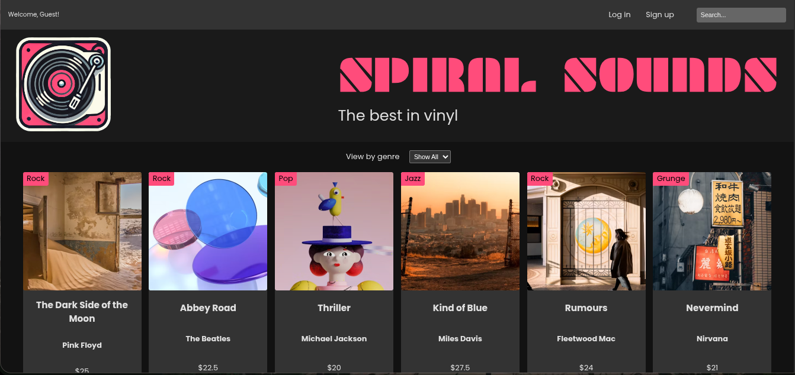

 # Spiral Sounds API
 
 Welcome to the Spiral Sounds API! This is the backend service for a music e-commerce platform, providing endpoints to manage and query a product catalog.

 ## Preview



 ## 🚀 Features
 
 *   **Product Catalog**: Serves a list of music products.
 *   **Genre Filtering**: Allows fetching products based on their genre.
 *   **Dynamic Search**: Provides a powerful search capability across product titles, artists, and genres.
 *   **Static File Serving**: Serves the frontend application.
 *   **Database Integration**: Uses SQLite for persistent data storage.
 
 ## 🛠️ Tech Stack
 
 *   **Backend**: Node.js, Express.js
 *   **Database**: SQLite3
 
 ## <caption> API Endpoints
 
 Here are the currently available endpoints:
 
 | Method | Endpoint                 | Description                                                                                             | Query Params                               |
 | :----- | :----------------------- | :------------------------------------------------------------------------------------------------------ | :----------------------------------------- |
 | `GET`  | `/products`              | Retrieves a list of all products. Can be filtered by genre or a search term.                            | `genre=<string>`, `search=<string>`        |
 | `GET`  | `/products/genres`       | Retrieves a list of all unique genres available in the product catalog.                                 |                                            |
 
 ### Example Usage
 
 *   **Get all products**:
     ```
     GET /products
     ```
 
 *   **Get products by genre**:
     ```
     GET /products?genre=Rock
     ```
 
 *   **Search for products**:
     ```
     GET /products?search=blue
     ```
 
 ## ⚙️ Getting Started
 
 ### Prerequisites
 
 *   Node.js (v14 or higher recommended)
 *   npm or yarn
 
 ### Installation & Setup
 
 1.  **Clone the repository:**
     ```bash
     git clone https://github.com/0xYurii/spiral-sounds.git
     cd spiral-sounds
     ```
 
 2.  **Install dependencies:**
     ```bash
     npm install
     ```
 
 3.  **Run the database setup script (if available):**
     *This project uses an SQLite database. A setup script populates it with initial data.*
     ```bash
     node setup-database.js 
     ```
     *(Note: The name of the setup script might differ.)*
 
 4.  **Start the server:**
     ```bash
     npm start
     ```
 
 The API will be running on `http://localhost:3000` (or the configured port).